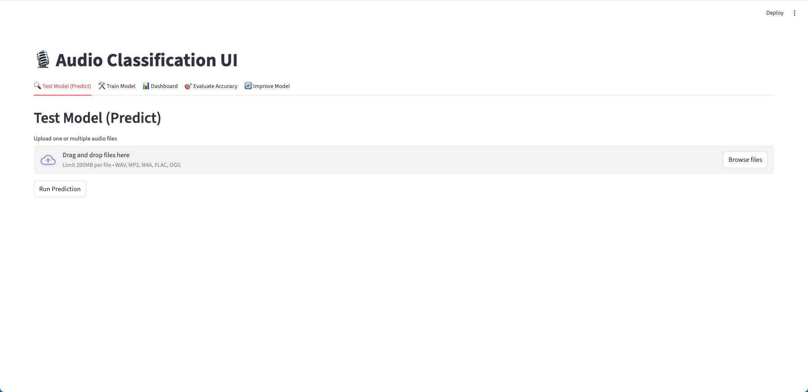
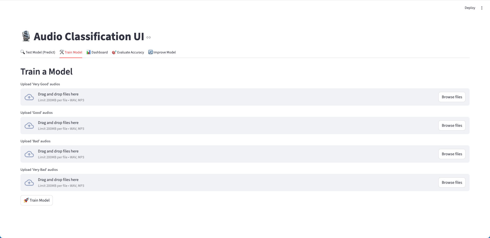
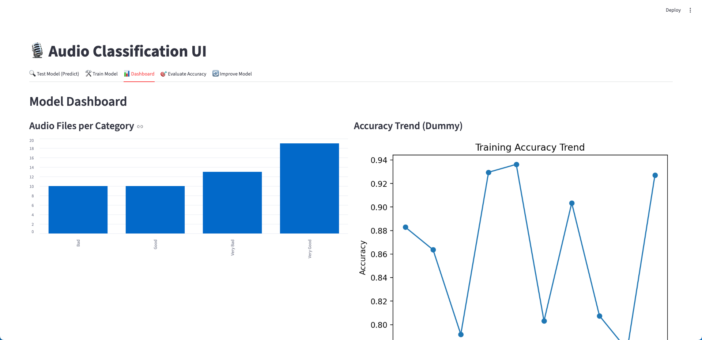
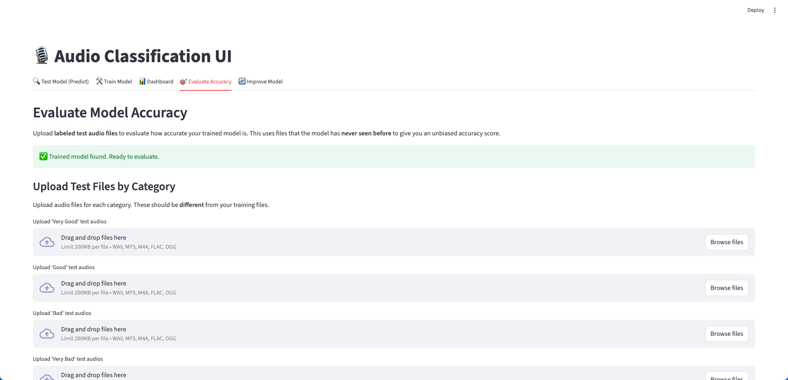
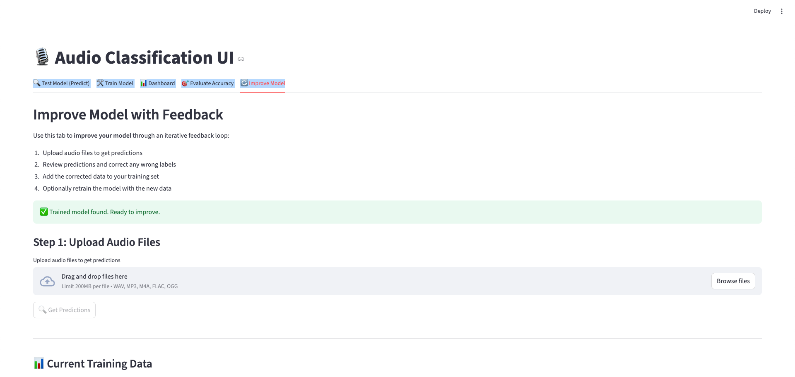

# wrp-model-ai

A machine learning pipeline for **classifying audio recordings** into quality categories:

- `very bad`
- `bad`
- `good`
- `very good`

This project uses Python, `librosa` for audio feature extraction, `scikit-learn` for classification, and **Streamlit** for an interactive web UI.

---

## Project Structure

```
wrp-model-ai/
├── main_streamlit.py     # Streamlit web UI (recommended)
├── main.py               # CLI: Train + evaluate (cross-validation)
├── main_fit_only.py      # CLI: Train on all data, no evaluation
├── predict.py            # CLI: Predict label of a new audio file
├── labels.csv            # File-to-label mapping
├── requirements.txt      # Dependencies
│
├── .streamlit/
│   └── config.toml       # Streamlit configuration (upload limits)
│
├── data/
│   └── audio/            # Audio files go here
│
├── models/
│   └── audio_clf_svm.joblib   # Saved model after training
│
└── utils/
    └── features.py       # Audio I/O, augmentation, feature extraction
```

---

## Setup

1. Create and activate a virtual environment:

   ```bash
   python3 -m venv venv
   source venv/bin/activate      # macOS/Linux
   venv\Scripts\activate         # Windows
   ```

2. Install dependencies:

   ```bash
   pip install -r requirements.txt
   ```

---

## Streamlit Web UI (Recommended)

Launch the interactive web interface:

```bash
streamlit run main_streamlit.py
```

### Tabs Overview

The UI has 5 tabs, each serving a specific purpose in the model lifecycle:

| Tab | Purpose |
|-----|---------|
| Test Model | Run predictions on new audio files |
| Train Model | Create a new model from labeled data |
| Dashboard | View training data statistics |
| Evaluate Accuracy | Test model performance with labeled test data |
| Improve Model | Iteratively improve the model with feedback |

---

### Tab 1: Test Model (Predict)

**Purpose:** Quickly classify audio files using your trained model.



**How to use:**
1. Upload one or more audio files (WAV, MP3, M4A, FLAC, OGG)
2. Click "Run Prediction"
3. View results with predicted labels and confidence scores

**Features:**
- Batch prediction support (upload multiple files at once)
- Confidence percentage for each prediction
- Audio playback to verify files
- Summary dashboard showing prediction distribution

**Use case:** When you have new audio recordings and want to know their quality classification.

---

### Tab 2: Train Model

**Purpose:** Train a new classification model from scratch using labeled audio data.



**How to use:**
1. Upload audio files into each category (Very Good, Good, Bad, Very Bad)
2. Click "Train Model"
3. Wait for training to complete
4. Review validation accuracy and metrics

**Features:**
- Separate upload areas for each label category
- Automatic data augmentation (5x per training clip)
- 80/20 train/validation split
- Displays validation accuracy, classification report, and confusion matrix
- Saves model to `models/audio_clf_svm.joblib`

**Use case:** When starting fresh or want to completely replace the existing model with new training data.

---

### Tab 3: Dashboard

**Purpose:** Visualize training data distribution and model statistics.



**Features:**
- Bar chart showing audio files per category
- Training accuracy trend visualization
- Confusion matrix display

**Use case:** Get a quick overview of your dataset balance and model performance.

---

### Tab 4: Evaluate Accuracy

**Purpose:** Measure how well your model performs on unseen test data.



**How to use:**
1. Upload labeled test audio files (files the model has never seen)
2. Assign each file to its true category
3. Click "Evaluate Model Accuracy"
4. Review detailed accuracy metrics

**Features:**
- Overall accuracy percentage
- Per-category precision, recall, and F1-score
- Confusion matrix with heatmap visualization
- Detailed results table with audio playback
- Highlighted list of misclassified files
- Listen to misclassified audio to understand errors

**Use case:** When you want an unbiased measure of model performance before deploying it.

---

### Tab 5: Improve Model

**Purpose:** Continuously improve your model through human feedback (active learning).



**How to use:**
1. **Step 1:** Upload audio files to get AI predictions
2. **Step 2:** Review each prediction and correct wrong labels using the dropdown
3. **Step 3:** Click "Save to Training Data" to add corrected files to your dataset
4. **Step 4:** Click "Retrain Model Now" to update the model with new data

**Features:**
- Side-by-side view of AI prediction vs your correction
- Audio playback for each file
- Visual status indicators (Confirmed/Corrected/New label)
- Summary of files to be added by category
- One-click retraining after adding new data
- Current training data statistics display
- "Clear & Start Over" button to reset the workflow

**Use case:** When the model makes mistakes and you want to teach it the correct answers. This creates a feedback loop where:
- Model predicts → You correct → Model learns → Model improves

**Workflow example:**
```
1. Upload 10 audio files
2. Model predicts: 8 correct, 2 wrong
3. You correct the 2 wrong predictions
4. Save all 10 to training data
5. Retrain model
6. Model now performs better on similar audio
```

---

## CLI Usage

### Data Preparation

Your `labels.csv` must have two columns:

```csv
file_name,label
audio1.mp3,very good
audio2.mp3,good
audio3.mp3,bad
audio4.mp3,very bad
```

- `file_name` → must exactly match the audio filename in `data/audio/`
- `label` → one of: `very bad`, `bad`, `good`, `very good`

### Train with Cross-Validation

Run Leave-One-Out CV (LOOCV) to get evaluation metrics:

```bash
python main.py
```

### Train Without Evaluation

Fit a model and save it:

```bash
python main_fit_only.py
```

### Predict on New Audio

Classify a new file:

```bash
python predict.py data/audio/your_file.mp3
```

Output example:

```
Prediction: good
very bad   -> 0.05
bad        -> 0.10
good       -> 0.70
very good  -> 0.15
```

---

## Configuration

### Upload Size Limit

The default upload limit is set to 2GB. To change it, edit `.streamlit/config.toml`:

```toml
[server]
maxUploadSize = 2000  # Size in MB
```

---

## Notes

- With very few samples, accuracy will be poor.
- Collect at least **20-50 recordings per class** for meaningful results.
- Consider merging into 2 classes (positive/negative) if dataset is too small.
- Use the **Improve Model** tab to iteratively add more training data.

---

## License

Prototype project for testing and learning — no license specified yet.
